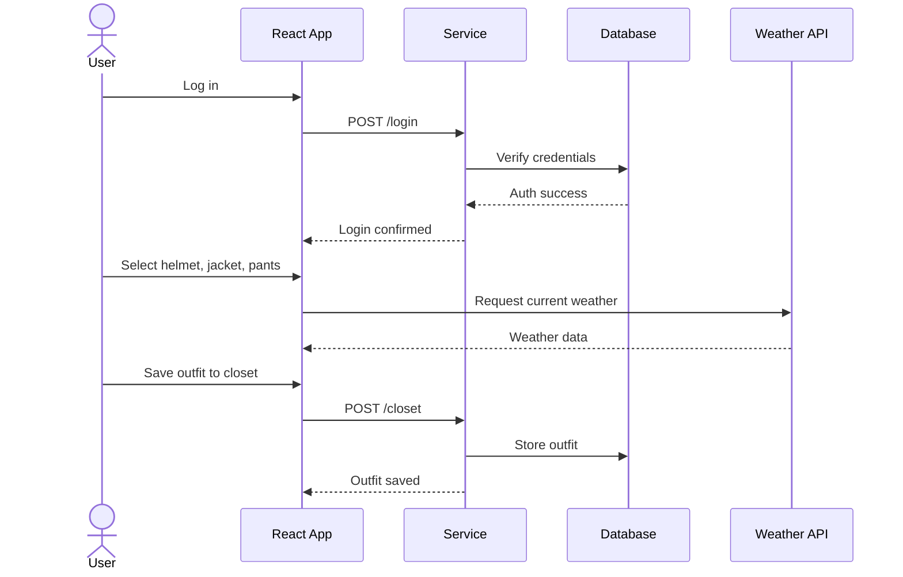

# Ski Outfit Picker

[My Notes](notes.md)

Description: I am wanting to implement an outfit picker for skiing/snowboarding. This program will allow you to select combinations of helmets, jackets, and pants. You will be able to save these different combinations to a closet where you can view them later. This will be similar to the zen garden application shown as an example in the assignment details.

> [!NOTE]
> This is a template for your startup application. You must modify this `README.md` file for each phase of your development. You only need to fill in the section for each deliverable when that deliverable is submitted in Canvas. Without completing the section for a deliverable, the TA will not know what to look for when grading your submission. Feel free to add additional information to each deliverable description, but make sure you at least have the list of rubric items and a description of what you did for each item.

> [!NOTE]
> If you are not familiar with Markdown then you should review the [documentation](https://docs.github.com/en/get-started/writing-on-github/getting-started-with-writing-and-formatting-on-github/basic-writing-and-formatting-syntax) before continuing.

## 🚀 Specification Deliverable

> [!NOTE]
> Fill in this sections as the submission artifact for this deliverable. You can refer to this [example](https://github.com/webprogramming260/startup-example/blob/main/README.md) for inspiration.

For this deliverable I did the following. I checked the box `[x]` and added a description for things I completed.

- [x] Proper use of Markdown
- [x] A concise and compelling elevator pitch
- [x] Description of key features
- [x] Description of how you will use each technology
- [x] One or more rough sketches of your application. Images must be embedded in this file using Markdown image references.

### Elevator pitch

Do you ever struggle to choose a new ski outfit for the season or plan out good combos to keep you looking steezy on the mountain? Well look no furtuer, the Ski Outfit Picker is the one stop shop for you! This app allows you to explore outfit variations and didferent combos of helmets, ski jackets, and snow pants BEFORE you hit the mountain or purchase that new jacket!

### Design

The sketch on the top left shows the initial login screen while the closet interface is displayed on the bottom left. The main outfit picker is displayed on the right. Users authenticate first, then select a helmet, jacket, and pants from card-based options with clear visual feedback for selected items. The closet view is where users can see previously saved outfit combinations. Each saved outfit displays the selected helmet, jacket, and pants together for easy comparison and recall.

### Key features

- Ability to scroll between different helmets, ski jackets, and ski pants and view different outfit combinations
- Ability to save outfit combinations to a closet
- Ability to get suggetions based on current weather
- Notifications when other users save outfits

### Technologies

I am going to use the required technologies in the following ways.

- **HTML** - Uses proper semantic HTML structure with two main pages: a login page and an outfit picker page. Includes sections for helmet, jacket, and pants selection, as well as navigation links to view saved outfits in the closet.
- **CSS** - Provides responsive styling that looks good on different screens. Includes clean spacing, strong color contrast, and subtle animations to highlight selected gear and interactions.
- **React** - Implements a single-page application with reusable components for login, outfit selection, and closet viewing. The UI updates based on user actions and authentication status.
- **Service** - Backend service with endpoints for user registration, login, logout, retrieving gear options, and saving or retrieving outfits. Integrates a third-party weather API to enhance outfit suggestions.
- **DB/Login** - Stores user authentication data, available gear items, and user-saved outfit combinations. Supports retrieving closet data specific to each authenticated user.
- **WebSocket** - Uses WebSockets to broadcast real-time updates to other users when anyone saves a new outfit. 

## 🚀 AWS deliverable

For this deliverable I did the following. I checked the box `[x]` and added a description for things I completed.

- [x] **Server deployed and accessible with custom domain name** - [My server link](https://izack.click).

## 🚀 HTML deliverable

For this deliverable I did the following. I checked the box `[x]` and added a description for things I completed.

- [ ] **HTML pages** - I did not complete this part of the deliverable.
- [ ] **Proper HTML element usage** - I did not complete this part of the deliverable.
- [ ] **Links** - I did not complete this part of the deliverable.
- [ ] **Text** - I did not complete this part of the deliverable.
- [ ] **3rd party API placeholder** - I did not complete this part of the deliverable.
- [ ] **Images** - I did not complete this part of the deliverable.
- [ ] **Login placeholder** - I did not complete this part of the deliverable.
- [ ] **DB data placeholder** - I did not complete this part of the deliverable.
- [ ] **WebSocket placeholder** - I did not complete this part of the deliverable.

## 🚀 CSS deliverable

For this deliverable I did the following. I checked the box `[x]` and added a description for things I completed.

- [ ] **Visually appealing colors and layout. No overflowing elements.** - I did not complete this part of the deliverable.
- [ ] **Use of a CSS framework** - I did not complete this part of the deliverable.
- [ ] **All visual elements styled using CSS** - I did not complete this part of the deliverable.
- [ ] **Responsive to window resizing using flexbox and/or grid display** - I did not complete this part of the deliverable.
- [ ] **Use of a imported font** - I did not complete this part of the deliverable.
- [ ] **Use of different types of selectors including element, class, ID, and pseudo selectors** - I did not complete this part of the deliverable.

## 🚀 React part 1: Routing deliverable

For this deliverable I did the following. I checked the box `[x]` and added a description for things I completed.

- [ ] **Bundled using Vite** - I did not complete this part of the deliverable.
- [ ] **Components** - I did not complete this part of the deliverable.
- [ ] **Router** - I did not complete this part of the deliverable.

## 🚀 React part 2: Reactivity deliverable

For this deliverable I did the following. I checked the box `[x]` and added a description for things I completed.

- [ ] **All functionality implemented or mocked out** - I did not complete this part of the deliverable.
- [ ] **Hooks** - I did not complete this part of the deliverable.

## 🚀 Service deliverable

For this deliverable I did the following. I checked the box `[x]` and added a description for things I completed.

- [ ] **Node.js/Express HTTP service** - I did not complete this part of the deliverable.
- [ ] **Static middleware for frontend** - I did not complete this part of the deliverable.
- [ ] **Calls to third party endpoints** - I did not complete this part of the deliverable.
- [ ] **Backend service endpoints** - I did not complete this part of the deliverable.
- [ ] **Frontend calls service endpoints** - I did not complete this part of the deliverable.
- [ ] **Supports registration, login, logout, and restricted endpoint** - I did not complete this part of the deliverable.

## 🚀 DB deliverable

For this deliverable I did the following. I checked the box `[x]` and added a description for things I completed.

- [ ] **Stores data in MongoDB** - I did not complete this part of the deliverable.
- [ ] **Stores credentials in MongoDB** - I did not complete this part of the deliverable.

## 🚀 WebSocket deliverable

For this deliverable I did the following. I checked the box `[x]` and added a description for things I completed.

- [ ] **Backend listens for WebSocket connection** - I did not complete this part of the deliverable.
- [ ] **Frontend makes WebSocket connection** - I did not complete this part of the deliverable.
- [ ] **Data sent over WebSocket connection** - I did not complete this part of the deliverable.
- [ ] **WebSocket data displayed** - I did not complete this part of the deliverable.
- [ ] **Application is fully functional** - I did not complete this part of the deliverable.
